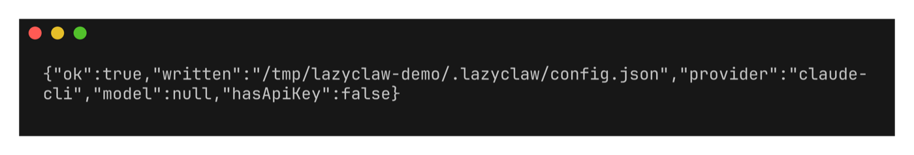
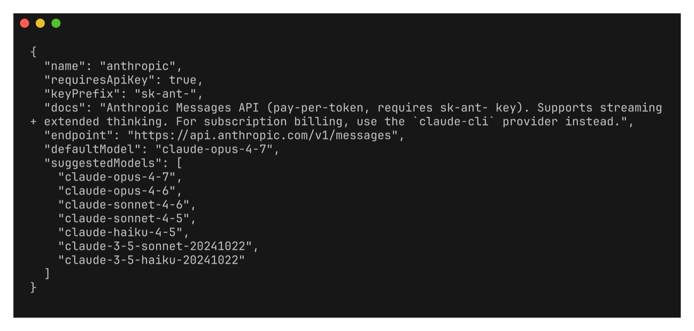

# lazyclaw

**A terminal agent that learns on your Claude subscription — for $0 — and reaches you on every channel.**

Chat in the terminal. Let the background learning loop distil your conversations into reusable skills on `claude-cli` (your Pro/Max subscription — no API bill). Wire it to Slack, Telegram, Discord, Matrix, Email, Signal, WhatsApp, or Voice. Fan a hard task out to a planner + workers. One small, auditable Node core — no daemon you can't read.

[](https://www.npmjs.com/package/lazyclaw)
[](https://nodejs.org/)
[](./LICENSE)

```bash
npx lazyclaw          # first run walks you through setup, then drops into chat
```


*한국어: [README.ko.md](./README.ko.md)*

---

## What it is

lazyclaw is a single-binary-feel Node CLI in the "claw" family (Hermes → OpenClaw → nanoclaw). It is **TUI-first**: `lazyclaw` with no arguments opens a chat REPL with a sloth splash, slash commands, and ghost-text autocomplete. Underneath, every turn feeds a learning loop, and the same agent answers from any messaging channel you connect.

You can read the whole thing. No hosted service, no telemetry, config in plain JSON at `~/.lazyclaw/`, secrets in `~/.lazyclaw/.env` (0600).

## Quick start

```bash
npm install -g lazyclaw     # or: npx lazyclaw
lazyclaw                    # fresh install → guided setup, then chat
```

The first run is a **phased wizard** (Hermes-style — get one clean chat working first, then layer the rest):

1. **Provider + model** — arrow-key picker (`claude-cli` is keyless; gemini/openai/anthropic take an API key).
2. **Verify** — a one-token ping confirms the provider answers.
3. **Context window** — how much history to keep per turn (optional).
4. **Channel** — Slack / Telegram / Matrix / HTTP built in; Discord / Email / Voice / WhatsApp ship in-tree (need a runtime dep via `lazyclaw channels install <name>`), Signal needs `signal-cli` (optional).
5. **Workspace / skills / webhook** (optional).
6. **Orchestration** — turn on the planner + workers pipeline (optional).

Re-run it any time with `lazyclaw setup`, or `/config` from inside chat.



## $0 self-learning

lazyclaw splits two provider slots: **`provider`** (chat — the hot path) and **`trainer`** (the learning loop — skill synthesis, reflection, the user model). They are independent, so a Claude Pro/Max subscription can power the learning while chat runs anywhere — or both run on one backend.

After every turn, a fire-and-forget loop records the trajectory and distils reusable skills, tagged `trained_by`. With `trainer: { provider: "auto" }` it auto-detects your `claude-cli` session and runs the loop for free; otherwise it mirrors the chat provider.

```jsonc
// ~/.lazyclaw/config.json
{
  "provider": "openai",            // chat: pay-per-token (or claude-cli, ollama, …)
  "model": "gpt-4.1",
  "trainer": { "provider": "auto" }  // learning: $0 on your Claude subscription
}
```

| Setup | `provider` | `trainer` | Cost |
|---|---|---|---|
| Subscription only | `claude-cli` | `auto` | **$0** |
| Hybrid (recommended) | `openai` / any | `auto` | chat only |
| Pure API | `openai` / any | `openai` | both metered |

## Talk to it anywhere

Connect a channel and **the same agent** answers there — every listener forwards into the always-on daemon's shared session store, so chat, the dashboard, and all channels are one agent with one memory (and context follows across channels). Slack, Telegram, Matrix, and HTTP are built in; Discord, Email, Voice, and WhatsApp ship in-tree and run once their runtime dependency is installed into the config dir (`lazyclaw channels install <name>`), and Signal needs the external `signal-cli` binary on your PATH.

```bash
lazyclaw service install              # 1) the always-on daemon (the shared brain)

# 2) point a listener at it (Slack Socket Mode: SLACK_BOT_TOKEN + SLACK_APP_TOKEN in ~/.lazyclaw/.env)
lazyclaw slack listen                 # forwards inbound to the daemon, replies in-thread
lazyclaw slack listen --provider orchestrator   # …and orchestrate the reply
lazyclaw slack listen --daemon-url http://127.0.0.1:19600   # non-default daemon

lazyclaw channels                     # view configured channels
lazyclaw channels enable|disable slack
lazyclaw channels install discord     # installs discord.js into ~/.lazyclaw and enables the channel
```

A listener is a thin forwarder: it owns the channel socket (Slack Socket Mode needs no public URL, just an app-level `xapp-` token) and POSTs each message to the daemon's `/inbound`, which binds the conversation to a persistent session and runs the provider. It needs a reachable daemon (`lazyclaw service install`, or `lazyclaw daemon`); override the target with `--daemon-url` / `LAZYCLAW_DAEMON_URL`. Set it all up from the wizard's channel step, or `/channels` in chat.

## Run it always-on

**One process, every channel:** `lazyclaw gateway` runs the daemon core *and* your configured channel transports (Slack Socket Mode / Telegram long-poll / Matrix sync) in a single process — and because the channels live in-process, `/handoff` can notify the target channel with a resume marker (a failed notify rolls the handoff back).

```bash
lazyclaw gateway                          # daemon core + every enabled channel, one process
lazyclaw gateway --channels slack         # explicit channel set
lazyclaw service install gateway          # …and keep it alive across reboots
```

The gateway is **authenticated by default**: it mints a bearer token on first run and persists it to `~/.lazyclaw/gateway.token` (0600, never logged). Its own channels use it automatically; external callers read it from the file (`--auth-token`/`--no-auth` to override).

Or run pieces separately: the daemon is the agent core — one provider path and one session/memory store on `127.0.0.1` — and `* listen` commands are standalone single-channel forwarders.

```bash
lazyclaw service install                 # daemon only: launchd (macOS) · systemd user unit (Linux) · pidfile fallback
lazyclaw service status
lazyclaw service uninstall
```

The backend is auto-detected (override with `--backend launchd|systemd|fallback`); flags pass through, e.g. `lazyclaw service install gateway --port 19600 --auth-token "$TOK" --channels slack`.

Inbound channel messages are **idempotent**: each message's native id (Slack `channel:ts`, Telegram `chat:message_id`, Matrix `event_id`) is deduplicated by the daemon — a redelivery or listener-restart replay returns the recorded reply instead of running the provider twice. And every session-bound channel turn feeds the same post-task **learning loop** as the chat REPL (trainer `auto` → your Claude subscription, $0).

> [!NOTE]
> A channel listener or the daemon refuses to start while `security.allowUnattendedSensitive=true` — that flag bypasses the fail-closed tool-approval gate for *every* inbound message, so an always-on surface plus that flag is a remote-code-execution path. Keep sensitive-tool approval interactive.
>
> **Unattended team runs are fail-closed.** When the daemon/gateway answers an inbound channel message with a `claude-cli` team, the spawned `claude` runs in read-only `plan` mode (it can inspect but cannot run bash or write files), regardless of your interactive `chat.permissionMode`. This closes the message-to-RCE path where an untrusted sender drives host commands with no human watching. Interactive `lazyclaw chat` is unchanged. To let unattended surfaces execute host commands, opt in explicitly with `security.unattendedExec=true`.

## Multi-agent orchestration

Set the provider to `orchestrator` and a hard request becomes **Plan → Delegate → Synthesise**: a planner decomposes the task, workers run the subtasks in parallel, then the planner merges the results. Workers are real agents with the tool registry.

```bash
lazyclaw orchestrator set-planner claude-cli:claude-sonnet-4-6
lazyclaw orchestrator workers add claude-cli:claude-sonnet-4-6
lazyclaw orchestrator on            # route chats through the pipeline
```

From chat: `/orchestrator` opens an on/off picker, or `/orchestrator on|off|planner <spec>|worker add <spec>`. Details: [docs/multi-agent.md](./docs/multi-agent.md).

## Drive it from chat

The REPL has slash commands for everything you'd otherwise edit config for — point-and-pick, no JSON:

| Slash | Does |
|---|---|
| `/config` | change one setting in-chat (provider/model/context/channel creds/webhook/…); `/setup` re-runs the whole wizard |
| `/provider` · `/model` | pick provider / model from a searchable list |
| `/trainer [set\|fallback]` · `/agent edit <name>` | pick the trainer / an agent's provider+model from the same list (with an `auto` and a custom-id row) |
| `/channels [<name> on\|off\|setup]` | view / toggle channels; `setup` sets the bot token & credentials in-chat |
| `/orchestrator [on\|off\|…]` | view / toggle multi-agent (picker on bare call) |
| `/context [turns N\|tokens N]` | resize the chat history window |
| `/agentic [on\|off]` · `/plan [on\|off]` | let chat run tools (approval-gated); plan mode is read-only "propose first" |
| `/skill` · `/personality` · `/memory` · `/loop` · `/goal` | skills, personas, memory, loops, goals |

`/help` lists them all. Autocomplete works as you type: command names (`/...`) and, after a command, its **arguments** — `/login` → `codex-cli`/`gemini-cli`, `/hud` → `on`/`off`, `/channels` → channel names, subcommands for `/task` `/team` `/agent` `/personality` `/trainer` `/orchestrator`, and more — appear in a popup (↑/↓ select, Enter fill). The 2-step provider→model picks (`/model`, `/trainer set`, `/orchestrator planner`) show a `↹ pick` hint; press **Tab** to open the drill-in modal. CJK/Hangul input composes inside the box.

Manage the always-on gateway without leaving the chat:

```
/gateway              # or /gateway status — pid, port, /health, auth, channels
/gateway start [--port N]   # spawn a detached gateway and wait for it to come up (--port is a one-off, not persisted)
/gateway port [N]     # print the effective port + its source (flag/config/default), or set + persist a new one
/gateway stop         # SIGTERM the recorded pid
```

The gateway records its pid to `gateway.pid` in the config dir, alongside the daemon's own `daemon.pid`. The port itself resolves in order: an explicit `--port` flag, then `gateway.port` in `config.json` (`dashboard.port` / `daemon.port` for the other two surfaces), then the historical default `19600` — so moving one surface off a collision doesn't require touching the others.

The REPL also animates when your terminal supports it: a launch reveal + wordmark shimmer, a braille streaming spinner with elapsed turn time, a `thinking…` indicator before the first token, a tweened context gauge, a live throughput meter in the HUD row, and a red input-border pulse after a failed turn.

| Env var | Effect |
|---|---|
| `LAZYCLAW_NO_MOTION` | `1` disables every terminal animation (launch intro, streaming spinner, gauge tween, error flash). Animation is also off automatically without a TTY, under `NO_COLOR`, and on `TERM=dumb`. |

## The dashboard

```bash
lazyclaw dashboard          # local web UI on http://127.0.0.1:19600 (override with --port N or dashboard.port in config.json)
```

From chat, `/dashboard [--port N]` (or `/dashboard stop`) does the same.

> [!IMPORTANT]
> Open it with `lazyclaw dashboard`, not a bare `lazyclaw daemon`. Only `cmdDashboard` sets the loopback-origin allowance the browser needs; Chromium sends an `Origin` header even on the module-script fetch for `dashboard.js` itself, so under a bare daemon that very request 403s and the page never boots — it just sits on "connecting…".

A framework-free, zero-build SPA (`web/` ships as source — native ES modules, no bundler, no `dist/`) over the daemon's JSON API: a grouped sidebar over 21 panels — Work, Agents, Automate, Knowledge, Gateway, System — a **⌘K** / **Ctrl+K** command palette, and a "Live" activity strip under the topbar, all fed by one Server-Sent Events connection (`GET /events`). Motion — the palette, the live rail, reordering rows — respects `prefers-reduced-motion`.

- **Team Live** now draws the real reporting hierarchy: each manager's reports sit under them, joined by edges, instead of a lead plus one flat row. Avatar tiles carry status rings + harness badges (`provider · model`); click one to drill into its harness, current task, and recent activity.
- **Tasks** shows where a task came from — a Slack channel + thread, or `lazyclaw task start` from the CLI — and the permission mode it actually ran under (attended, unattended-but-read-only, or the unattended-with-execution case worth flagging), plus a transcript viewer; a `task:` hit in Recall links straight to the same transcript.
- **Approvals** and **Devices** are new panels, both **read-only**: resolving an approval needs a paired device's Ed25519 token, which the dashboard isn't — approve from a paired device or with `lazyclaw nodes`. The Approvals sidebar badge itself only refreshes when you open the Approvals panel; those events don't yet reach the dashboard's SSE stream, so the badge doesn't move while you're on another panel.
- The live rail picks up four new event types: `workflow.step`, `cost.tick`, `channel.inbound`, `provider.error`. `cost.tick` only fires for team-routed traffic — the plain `/chat` and `/agent` paths never feed the configured cap to the cost accountant. There's no `cron.fire`: a scheduled job runs in whatever subprocess launchd/cron spawns, with no link back to the daemon's event bus, so a fire isn't observable here at all.
- **⌘K** jumps to any panel plus four fixed actions (start a task, new team, review approvals, rebuild the search index) — it doesn't resolve a team or agent by name.
- **Chat**'s model picker lists each provider's live model catalogue when one is reachable (grouped per provider, since a live fetch can return hundreds), instead of a fixed curated set, and tags the picker `live`/`builtin` so a fetched list is never mistaken for a frozen one. Without a live fetch it falls back to `npm run models:sync`'s last run, then the hand-written defaults — so the list is never empty just because a credential isn't configured on this machine.

## Providers

| Chat / trainer | Auth |
|---|---|
| `claude-cli` | subscription (Pro/Max) — keyless |
| `anthropic` · `openai` · `gemini` | API key |
| `ollama` | local, no key |
| `nim` · `openrouter` · `groq` · `together` · `xai` · `deepseek` · `mistral` · `fireworks` | OpenAI-compatible API key |
| `custom` | any OpenAI-compatible v1 endpoint (your base URL + key) |
| `orchestrator` | meta-provider — planner + workers over any of the above |



## What else it ships

- **Tool registry** — 12 categories (`agents`, `browser`, `coding`, `exec`, `fs`, `git`, `iot`, `learning`, `media`, `net`, `os`, `scheduling`) plus stdio MCP. Sensitive tools (shell, write, network) are **fail-closed** behind an approval hook by default.
- **Skills** — markdown instruction bundles composed into the system prompt. `lazyclaw skills starter` installs the bundled pack (`concise` · `korean` · `commit-message` · `code-review` · `channel-style` · `summarize` · `explain` · `debug-coach`); `lazyclaw skills install <user>/<repo>` pulls more from GitHub; `/skills` picks one in chat.
- **Durable recall** — one SQLite + FTS5 index over sessions, skills, trajectories, and memory; rebuildable from the corpus (`lazyclaw index rebuild`). Optionally blend in embedding similarity (`cfg.recall.embeddings`, off by default; OpenAI/Gemini key or a local Ollama model — the $0 path stays pure FTS5); `lazyclaw index embed` backfills the vectors.
- **Loops & goals** — durable foreground/`--detach` loops and cron-scheduled goals that survive restart.
- **Personas** — layered SOUL / workspace / personality / role / user-model / skills compose into the system prompt.
- **Agent teams, live** — build a hierarchy (a planner agent with sub-agents on different harnesses, e.g. a data-engineer on `gemini-cli` and a backend on `claude-cli`) via each agent's `manager`; a Slack message to a team's channel auto-routes into the multi-agent loop, and the **Team Live** dashboard tab shows who is doing what, on which harness, and the real-time A→B delegation as it happens.
- **Default-on confinement** — sensitive tools (`bash`, `python_exec`/`node_exec`, `git_*`, the `os` tools) run confined by default: writes are limited to the workspace + temp, secret dirs (`~/.ssh`, `~/.aws`, the config dir, …) are unreadable, and the secret-scrubbed env still applies. macOS uses `seatbelt`, Linux uses `bubblewrap`/`firejail` (auto-detected). Network is allowed; opt out with `cfg.sandbox.confine=false`. Run `lazyclaw sandbox status` to see the effective posture.
- **Sandboxes** — `local` / `docker` / `ssh` / `singularity` / `modal` / `daytona` behind one API; pluggable backends for heavier isolation (containers, remote hosts) layered on top of the default local confinement.
- **MCP** — stdio MCP servers in `cfg.mcp.servers` boot with the daemon; their tools register as `mcp:<server>:<tool>` (always approval-gated). Manage them from the CLI: `lazyclaw mcp list` / `mcp add <name> --command <cmd> [--args "…"] [--allow-glob <glob>]` / `mcp remove <name>` / `mcp call <server> <tool> [--args-json '{…}']` (spawns the server, runs one tool, tears it down).
- **Daemon lifecycle** — `lazyclaw daemon status | stop | logs` over a pidfile; `maxTokens` in config raises the output cap; `LAZYCLAW_REQUEST_TIMEOUT_MS` sets the per-provider idle timeout (default 120s).

## Configuration & security

Config is plain JSON at `~/.lazyclaw/config.json` — parsed with `JSON.parse`, no shell or code execution; channel + provider secrets live in `~/.lazyclaw/.env` (written 0600, never logged). Move the dir with `LAZYCLAW_CONFIG_DIR=/path`.

Sensitive tools deny by default unless an approval hook grants them; `config.json` and workflow state are written owner-only; secrets are scrubbed from the `bash` tool's child env and redacted from trajectories and synthesised skills.

## Install / hack

```bash
npm install -g lazyclaw                 # install
git clone https://github.com/cmblir/lazyclaw && cd lazyclaw && npm install && npm link   # hack
node --test tests/*.test.mjs            # run the suite
```

Requires **Node 18+** (Node 22+ for Slack Socket Mode). macOS / Linux / WSL are first-class.

## Docs

- [docs/multi-agent.md](./docs/multi-agent.md) — orchestrator pipeline + Slack teams
- [docs/trainer-recipes.md](./docs/trainer-recipes.md) — $0, hybrid, and `auto` trainer configs
- [docs/persona-cookbook.md](./docs/persona-cookbook.md) — persona compose stack
- [docs/loop-goal-preflight.md](./docs/loop-goal-preflight.md) — loops + scheduled goals
- [CHANGELOG.md](./CHANGELOG.md) — release notes · [README.ko.md](./README.ko.md) — Korean

## License

[MIT](./LICENSE) · Source & issues: [cmblir/lazyclaw](https://github.com/cmblir/lazyclaw)
