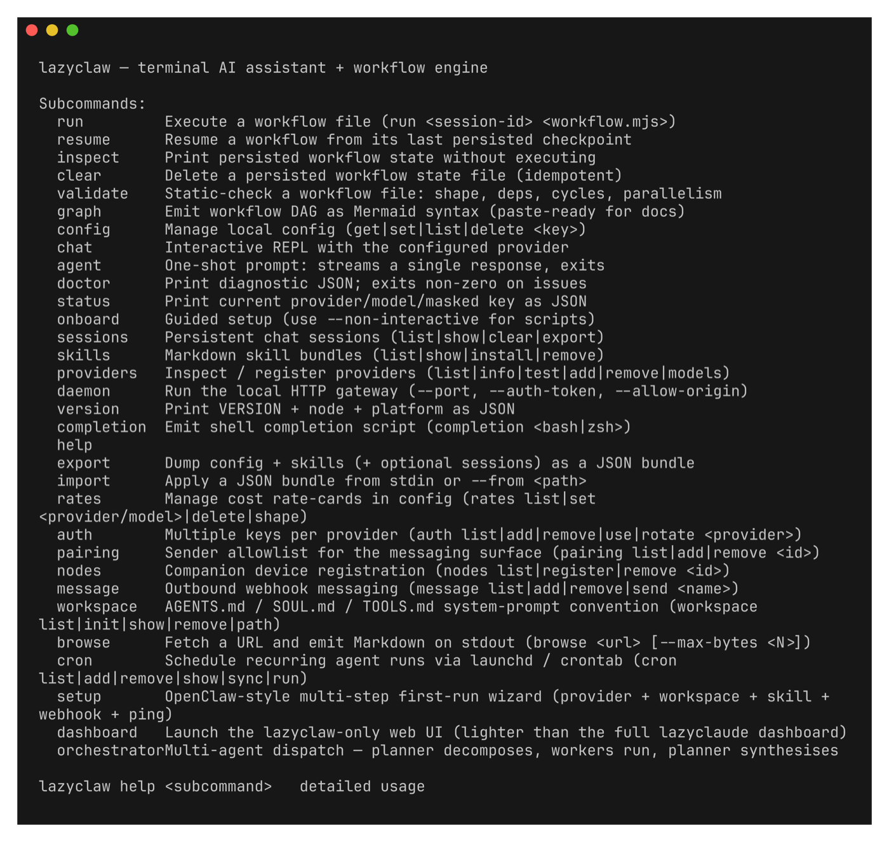
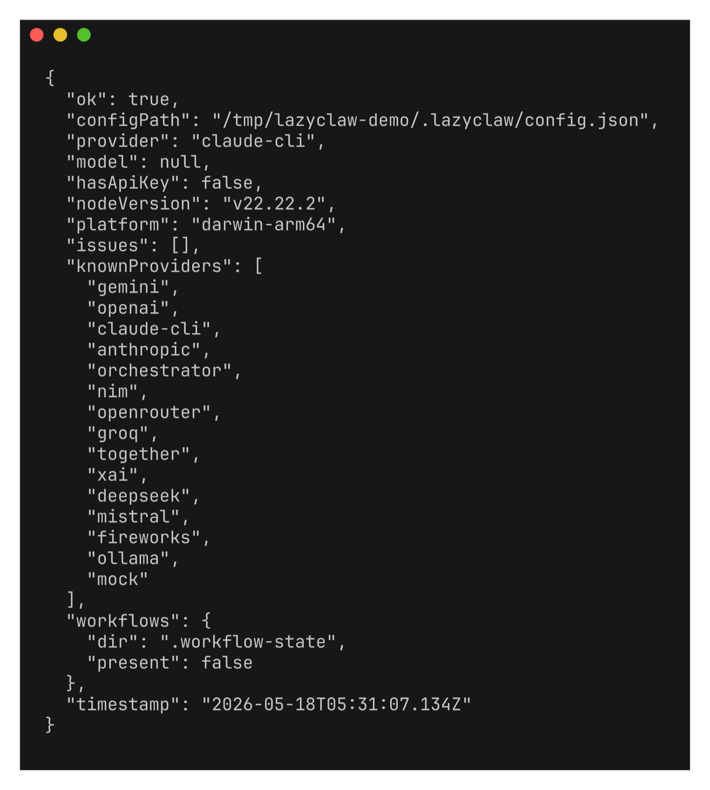

# 🦞 lazyclaw

[](https://www.npmjs.com/package/lazyclaw)
[](./LICENSE)
[](https://nodejs.org/)

> **v5.0 GA** — separate `trainer` provider for $0 learning on
> Claude Pro/Max, FTS5 cross-CLI recall, persona 7-layer compose,
> 6-backend sandbox. See [`docs/migration-v4-to-v5.md`](./docs/migration-v4-to-v5.md).
>
> 한국어 안내: [`README.ko.md`](./README.ko.md).

**A lazy, elegant terminal CLI for Claude / OpenAI / Gemini / Ollama.**

One Node CLI that talks to every major LLM provider, runs multi-step workflows as a DAG, exposes a local HTTP gateway, and ships with the niceties you actually want at the prompt: an ASCII banner on launch, Cursor-style slash-command ghost autocomplete (right-arrow accepts), persistent chat sessions, and cost rate cards.

> Standalone CLI. A companion dashboard, [LazyClaude](https://github.com/cmblir/LazyClaude), wraps the same providers in a web UI — but `lazyclaw` needs nothing from it: `npm i -g lazyclaw` and go.

Every subcommand at a glance — `lazyclaw --help`:



---

## Install

```bash
npm install -g lazyclaw
lazyclaw version          # → { "version": "5.0.0", "nodeVersion": "...", "platform": "..." }
```

Requires **Node 18+**. Works on macOS / Linux / WSL. Windows native PowerShell mostly works but the ghost-text + ANSI banner are TTY-gated and may fall back to plain prompts.

## First run

```bash
lazyclaw onboard         # arrow-key picker; defaults to claude-cli (no key)
lazyclaw status          # current provider/model + masked key
lazyclaw doctor          # validate config + provider registry
```

`onboard` writes `~/.lazyclaw/config.json`. Move it with `LAZYCLAW_CONFIG_DIR=/elsewhere`. For automation: `--non-interactive --provider X --model Y [--api-key Z]`.




### Subscription mode (no API key)

If you already have **Claude Code** installed and signed in (Pro / Max / Team subscription), pick the **`claude-cli`** provider during onboard. lazyclaw shells out to the local `claude` binary, so requests bill against your existing subscription quota instead of pay-per-token API credit. No `sk-ant-` key needed.

```bash
lazyclaw onboard --non-interactive --provider claude-cli --model claude-opus-4-7
lazyclaw status
# → { provider: "claude-cli", model: "claude-opus-4-7", hasApiKey: false }
```

Same flow for `ollama` (local models, also keyless).

### Pay-per-token mode (API key)

Pick `anthropic` / `openai` / `gemini` and supply the matching key:

```bash
lazyclaw onboard --non-interactive --provider openai \
  --model gpt-4.1 --api-key sk-...
```

`onboard` only prompts for an api-key when the picked provider's `requiresApiKey` is true (the picker labels each row `[subscription]` / `[api key]` / `[no key]` so the choice is explicit).

### Built-in OpenAI-compatible vendors

Eight popular OpenAI-compatible services ship as first-class providers — pick one in the setup picker (no `+ Add custom` walkthrough needed) or set the matching environment variable and they Just Work:

| Provider | Models include | Env var |
|---|---|---|
| `nim`        | `meta/llama-3.1-405b-instruct`, `nvidia/llama-3.1-nemotron-70b-instruct`, `deepseek-ai/deepseek-r1`, `mistralai/mixtral-8x22b-instruct-v0.1` | `NVIDIA_API_KEY` (or `NIM_API_KEY`) |
| `openrouter` | `anthropic/claude-3.5-sonnet`, `openai/gpt-4o`, `meta-llama/llama-3.1-405b-instruct`, `deepseek/deepseek-r1` | `OPENROUTER_API_KEY` |
| `groq`       | `llama-3.3-70b-versatile`, `mixtral-8x7b-32768`, `deepseek-r1-distill-llama-70b` | `GROQ_API_KEY` |
| `together`   | `meta-llama/Llama-3.3-70B-Instruct-Turbo`, `Qwen/Qwen2.5-72B-Instruct-Turbo`, `deepseek-ai/DeepSeek-V3` | `TOGETHER_API_KEY` |
| `xai`        | `grok-2-latest`, `grok-2-vision-1212` | `XAI_API_KEY` (or `GROK_API_KEY`) |
| `deepseek`   | `deepseek-chat`, `deepseek-reasoner` | `DEEPSEEK_API_KEY` |
| `mistral`    | `mistral-large-latest`, `codestral-latest`, `pixtral-large-latest` | `MISTRAL_API_KEY` |
| `fireworks`  | `accounts/fireworks/models/llama-v3p3-70b-instruct`, `…/deepseek-r1` | `FIREWORKS_API_KEY` |

```bash
# NVIDIA NIM via env var — no `lazyclaw onboard` needed
export NVIDIA_API_KEY=nvapi-...
lazyclaw chat --provider nim --model meta/llama-3.1-405b-instruct

# Or commit the choice to ~/.lazyclaw/config.json
lazyclaw onboard --non-interactive --provider nim \
  --model nvidia/llama-3.1-nemotron-70b-instruct --api-key nvapi-...
```

Need a vendor that's **not** built-in? `+ Add a custom OpenAI-compatible endpoint…` inside the setup picker (or `lazyclaw providers add <name> --base-url <url>`) still works for vLLM / LM Studio / private gateways / anything else that speaks the OpenAI v1 wire format.

### `orchestrator` — multi-agent dispatch as a provider

`orchestrator` is a synthetic provider that composes the others. A chat message hitting `PROVIDERS.orchestrator` triggers a three-phase pipeline instead of a single 1:1 call:

1. **PLAN** — the *planner* provider decomposes the request into 2–5 parallel subtasks (JSON-only system prompt; fences / prose tolerated).
2. **EXECUTE** — each subtask is dispatched round-robin across the *workers*. Replies stream inline so you watch progress in real time.
3. **SYNTHESIS** — the planner re-enters with every worker's output and writes the final user-facing answer.

Configure in `~/.lazyclaw/config.json`:

```json
{
  "provider": "orchestrator",
  "orchestrator": {
    "planner": "claude-cli:claude-opus-4-7",
    "workers": [
      "claude-cli:claude-sonnet-4-6",
      "openai:gpt-4o",
      "gemini:gemini-2.5-pro",
      "nim:meta/llama-3.1-405b-instruct"
    ],
    "maxSubtasks": 5
  }
}
```

Then `lazyclaw chat` (or any other entry point that ends up calling a provider — `lazyclaw agent`, the daemon's `POST /agent` / `POST /chat`, the dashboard chat tab) routes through the orchestrator. Each worker's api-key is resolved through the same chain a direct chat would use (`authProfiles` → `customProviders` → built-in env var → legacy `cfg['api-key']`).

Defaults fall back gracefully: `planner` defaults to `cfg.provider`/`cfg.model`, `workers` defaults to `[planner]` (single-agent chain, still benefits from plan + synthesis structure). Self-recursion (`planner: "orchestrator"`) is rejected up front.

You can skip the JSON entirely and configure via `lazyclaw onboard` / `lazyclaw setup` (the picker lands on the orchestrator and walks you through a planner + workers wizard) **or** via the dedicated CLI:

```bash
lazyclaw orchestrator status
lazyclaw orchestrator set-planner claude-cli:claude-opus-4-7
lazyclaw orchestrator workers add openai:gpt-4o
lazyclaw orchestrator workers add gemini:gemini-2.5-pro
lazyclaw orchestrator workers set claude-cli:claude-sonnet-4-6,nim:meta/llama-3.1-405b-instruct   # bulk replace
lazyclaw orchestrator set-max-subtasks 5
lazyclaw orchestrator clear                                                                       # wipe cfg.orchestrator
lazyclaw config set provider orchestrator                                                          # route chats through it
```

## Launcher (no-arg `lazyclaw`)

Running `lazyclaw` with no subcommand drops into an arrow-key launcher with every subcommand laid out as a menu. Navigation:

| Key | What it does |
|---|---|
| `↑` / `↓` / `Home` / `End` / `PgUp` / `PgDn` | Move the selection |
| `Enter` | Run the highlighted item |
| `q` / `Esc` / `Ctrl-C` | Leave lazyclaw |
| `/` | Open an inline slash-command prompt |

Slash commands at the launcher (typed after `/`):

| Slash | What it does |
|---|---|
| `/exit` / `/quit` | Leave lazyclaw |
| `/help` | List launcher slash commands inline |
| `/version` | Print version + node + platform |

The slash buffer lives just below the menu — backspace edits it, deleting past `/` returns to menu mode, and `Esc` cancels slash mode without leaving lazyclaw.

## Interactive chat

```bash
lazyclaw chat                      # banner + active provider/model + REPL
lazyclaw chat --pick               # arrow-key picker before the prompt
lazyclaw chat --session daily      # persist turns to ~/.lazyclaw/sessions/daily.jsonl
lazyclaw chat --skill review,style # compose named skills as the system prompt
```

What you see on launch (TTY only):

```text
  ╭──────────────────────────────╮
  │   _                          │
  │  | |__ _ _____  _ _          │
  │  | / _` |_ / || | '_|         │
  │  |_\__,_/__\_, |_|            │
  │  LazyClaw  |__/  5.0.0       │
  ╰──────────────────────────────╯

  provider · anthropic
  model    · claude-opus-4-7
  slash    · /help · /model · /provider · /exit
  hint     · → to accept the suggested command, Tab to cycle

›
```

Slash commands inside the REPL:

| Slash | What it does |
|---|---|
| `/help` | List slash commands |
| `/status` | Print provider + model + masked key |
| `/provider` | Open the family / provider / model arrow picker |
| `/provider X` | Switch active provider directly by name |
| `/model` | Open the per-provider model picker (type-filter + live `/v1/models` fetch) |
| `/model X` | Switch model directly. Accepts unified `provider/model` form |
| `/skill a,b` | Replace the system prompt with a composition of named skills |
| `/loop "<prompt>" [--max N] [--until "<regex>"]` | Repeat one prompt N times (default 3, cap 50). `--until` short-circuits when the regex matches. Ctrl-C aborts the loop. |
| `/loop "..." --use-memory --recall "<query>"` | Inject `~/.lazyclaw/memory/core.md` and the top-3 matching episodic/recent fragments into the system slot per iteration |
| `/goal` | List active goals |
| `/goal <name>` | Switch the chat to the goal's session (subsequent turns persist to `goal:<name>.jsonl`) |
| `/goal add <name> [--desc "..."] [--cron "<spec>"]` | Register a persistent goal; `--cron` schedules `lazyclaw goal tick <name>` |
| `/goal close <name> [done\|abandoned]` | Close the goal and uninstall its cron entry |
| `/memory [core\|recent\|episodic [topic]]` | Show layered memory contents |
| `/dream` | Consolidate `recent.jsonl` into per-topic `episodic/<topic>.md` files |
| `/agent` / `/agent list` | List registered multi-agent agents |
| `/agent show <name>` | Print the agent's JSON record |
| `/agent add <name> [role text…]` | Register an agent with the default tool whitelist `[bash, read, write, grep]` |
| `/agent remove <name>` | Delete the agent's record |
| `/team` / `/team list` | List teams + lead + members + Slack channel |
| `/team add <name> --agents a,b,c [--lead a] [--channel #x]` | Create a team |
| `/team remove <name>` | Delete the team |
| `/usage` | Message count + chars + cumulative token totals |
| `/new` / `/reset` | Wipe history and start over |
| `/exit` | Leave the chat REPL (returns to the launcher when chat was opened from it) |

**Cursor-style ghost autocomplete**: type `/` and the longest matching slash command appears in dim grey after the cursor. **`→`** accepts; **`Tab`** cycles. **Ctrl-C** during a streaming reply aborts that turn (not the whole process); **Ctrl-C** at an empty prompt exits.

## One-shot (no REPL)

```bash
lazyclaw agent "summarize: $(cat file.md)"
lazyclaw agent - < prompt.txt                 # stdin
lazyclaw agent "..." --provider openai --model gpt-4.1
lazyclaw agent "..." --skill review           # compose system prompt
lazyclaw agent "..." --usage                  # token counts on stderr
lazyclaw agent "..." --cost                   # USD when rates configured
```

## Loops and goals (durable agents)

```bash
# Repeat one prompt N times against the active provider. Foreground
# blocks the terminal; --detach forks a worker and prints {loopId,
# pid, statePath}. Worker state under ~/.lazyclaw/loops/<id>/.
lazyclaw loop "fix the failing tests" --max 5 --until "DONE"
lazyclaw loop "ship checklist" --max 10 --detach --session daily
lazyclaw loops list
lazyclaw loops show <loopId>
lazyclaw loops tail <loopId>
lazyclaw loops kill <loopId>      # SIGTERM; repeat within 5s for SIGKILL

# Goals: persistent objectives with optional cron schedule + channel fan-out.
lazyclaw goal add ship-v4 --desc "Ship v4" --cron "0 9 * * 1-5"
lazyclaw goal list
lazyclaw goal tick ship-v4 --force
lazyclaw goal channel add ship-v4 slack:#deploys
lazyclaw goal close ship-v4 done  # also uninstalls the cron entry

# Memory: ~/.lazyclaw/memory/{core.md,recent.jsonl,episodic/*.md}
lazyclaw memory show core
lazyclaw memory show recent
lazyclaw memory dream             # consolidate recent → episodic files
lazyclaw memory edit core         # open $EDITOR
```

For Slack fan-out, set `SLACK_BOT_TOKEN` (xoxb-...) in `~/.lazyclaw/.env`.
Tokens never appear in goal records or logs. Socket Mode inbound also
needs `SLACK_APP_TOKEN` (xapp-...) and `SLACK_SIGNING_SECRET`.

## Multi-agent Slack teams (v4.1)

Drive a small team of named agents through a single Slack thread. The
lead agent receives the user's request, decides who else on the team
should weigh in, `@mentions` them, and the router runs each mentioned
agent in turn through the full tool-use loop (bash / read / write /
grep) before handing control back. The thread terminates when the lead
emits the literal marker `[[TASK_DONE]]` or the per-task iteration
budget runs out. Each agent's reply is mirrored into the Slack thread
under its own persona (`chat:write.customize` makes the username + icon
match the agent in Slack's UI).

```bash
# 1) Register agents — system prompt + provider + per-agent tool whitelist
lazyclaw agent add planner  --role "Project planner"   --provider anthropic --model claude-opus-4-7
lazyclaw agent add backend  --role "Backend engineer"  --provider anthropic --model claude-opus-4-7
lazyclaw agent add frontend --role "Frontend engineer" --provider openai    --model gpt-4.1
lazyclaw agent list

# 2) Group them into a team that talks in a specific Slack channel
lazyclaw team add shop --agents planner,backend,frontend --lead planner --channel '#shop'

# 3) Open a task — posts a root message into the team's channel, returns
#    the task id and the Slack thread_ts.
lazyclaw task start --team shop --title "ship checkout flow" --description "MVP scope"

# 4) Drive one user turn through the mention router. The lead replies,
#    @mentions teammates, they run tool-use loops, hand back to the lead.
lazyclaw task tick t_20260518_xxxxxx "go" --max-turns 12

# 5) Inspect the conversation (text, markdown, or raw JSON)
lazyclaw task transcript t_20260518_xxxxxx --format md > thread.md
lazyclaw task show       t_20260518_xxxxxx
lazyclaw task done       t_20260518_xxxxxx   # or `abandon` — also posts a closing message

# 6) Agent memory carries lessons forward across tasks (v4.2). The
#    router auto-fires a ≤6-bullet reflection per participating agent
#    when a task transitions to done. Manual control:
lazyclaw agent memory show planner
lazyclaw agent memory edit planner          # opens $EDITOR
lazyclaw agent memory clear planner
lazyclaw agent reflect planner --task t_20260518_xxxxxx
# Flip auto reflection off per agent: edit ~/.lazyclaw/agents/<name>.json
# and set "memoryWrite": "off" (other values: "auto" default, "manual").
```

### Self-improving skills (v4.3)

Reflection writes free-text *lessons* to an agent's memory. A **skill**
goes further: it distils a finished task into a reusable, structured
`SKILL.md` (`## When to Use` / `## Procedure` / `## Pitfalls` /
`## Verification`) that any future agent can load. This is the Hermes
self-improving-skill pattern — synthesise once, recall forever.

```bash
# Synthesise a skill from a finished task. Mirrors `agent reflect`:
# one LLM call over the transcript → a SKILL.md installed into
# ~/.lazyclaw/skills/<name>.md (frontmatter created_by: agent).
lazyclaw agent skill-synth planner --task t_20260518_xxxxxx
lazyclaw agent skill-synth planner --task t_20260518_xxxxxx --dry-run  # print, don't write

# Opt an agent into AUTOMATIC synthesis on task done (default is manual):
lazyclaw agent add researcher --skill-write auto   # auto | manual (default) | off
```

**Recall is progressive-disclosure.** Every agent turn gets a compact
*index* of installed skills (name + one-line summary) injected into its
system prompt — cheap, a line per skill. The agent pulls a full skill
body on demand with the built-in read-only **`skill_view`** tool, so
skill bodies never bloat the prompt until they're actually needed.
`skill_view` ships in the default tool whitelist, so newly-created
agents recall skills out of the box; older agents pick it up via
`lazyclaw agent edit <name> --tools bash,read,write,grep,skill_view`.

`skill-synth` defaults to `manual` (you run the command, or pass
`--dry-run` to review first) because a synthesised skill feeds every
future agent's prompt — keep it opt-in until you trust an agent's
output. Flip the trigger any time with
`lazyclaw agent edit <name> --skill-write auto|manual|off`.

Auto-synthesis is defended for the cases where it runs unattended:
secret-shaped tokens (`sk-…`, `ghp_…`, `AKIA…`, bearer tokens,
`*_KEY=…`, PEM blocks) are redacted from both the transcript sent to
the model and the saved skill; synthesised bodies are size-capped and
the `[[TASK_DONE]]` marker is neutralised; and a synthesised skill
**never overwrites a human-authored skill** — on a name collision it
takes the next free `name-N` slug, only ever overwriting (and
version-bumping) its own prior output. Skill bodies are framed to the
model as untrusted reference, not instructions.

Slack inbound (a user pings `@lazyclaw` in a channel, the bot replies)
runs through the Socket Mode listener:

```bash
lazyclaw slack listen     # foreground; connects, reacts with :eyes:, replies in thread
```

### Telegram — zero-install mobile control (v4.3)

Control lazyclaw from your phone with no app to install and no public
URL: the Telegram listener long-polls the Bot API (works behind NAT),
pipes each inbound message through the active provider, and replies in
the same chat. Push notifications are handled by Telegram itself.

```bash
# 1) Create a bot with @BotFather, then store its token:
echo 'TELEGRAM_BOT_TOKEN=123456:ABC...' >> ~/.lazyclaw/.env

# 2) (recommended) restrict who can drive it — your Telegram numeric user id:
lazyclaw pairing add 987654321

# 3) Listen. Foreground; Ctrl-C to stop. An empty pairing allowlist
#    means "reply to anyone who messages the bot".
lazyclaw telegram listen --provider anthropic --model claude-opus-4-7
```

The `pairing` allowlist doubles as the Telegram sender allowlist, so
only paired ids get a reply.

### Matrix + generic inbound (v4.3)

The same pattern extends to **Matrix** over the client-server `/sync`
long-poll (no SDK):

```bash
printf 'MATRIX_HOMESERVER=https://matrix.org\nMATRIX_ACCESS_TOKEN=...\nMATRIX_USER_ID=@you:matrix.org\n' >> ~/.lazyclaw/.env
lazyclaw matrix listen                        # pairing allowlist = @user:server ids
```

For any platform lazyclaw doesn't natively speak (Discord DMs, WhatsApp,
Signal, Email — each needs a heavy SDK or external binary), run your own
relay and forward messages to the **generic inbound webhook** on the
daemon — no extra dependency in lazyclaw:

```bash
curl -s localhost:<port>/inbound -H 'content-type: application/json' \
  -d '{"text":"hi from anywhere","senderId":"123","threadId":"discord:42"}'
# → { "reply": "...", "threadId": "discord:42" }
```

`/inbound` runs the active provider and is auth-token-gated; when a
`pairing` allowlist exists, `senderId` must be on it. Native adapters
(Telegram, Matrix, Slack) all implement the same `channels/base.mjs`
contract, so an SDK-backed channel can be dropped in later behind an
explicit dependency review.

The CLI is mirrored by daemon HTTP routes (`GET/POST/PATCH/DELETE
/agents|teams|tasks`, `GET /tasks/<id>/transcript`) and by the
browser dashboard's Agents / Teams / Tasks tabs:

```bash
lazyclaw dashboard       # opens http://127.0.0.1:<port>/ in the default browser
```

Slack app prerequisites — bot token scopes `app_mentions:read`,
`chat:write`, `chat:write.customize`, `im:history`, `im:read`,
`im:write`, `channels:history`, `reactions:write`; Socket Mode enabled;
app token scope `connections:write`; invite the bot into every team
channel. Tokens live exclusively in `~/.lazyclaw/.env` and never appear
in agent/team/task records or logs.

For the full data model + phase plan, see `docs/multi-agent.md`.

## Providers / sessions / skills

```bash
lazyclaw providers list                       # all registered providers
lazyclaw providers info anthropic
lazyclaw providers test anthropic             # 1-token reachability probe

lazyclaw sessions list                        # persisted chats
lazyclaw sessions show daily
lazyclaw sessions search "deploy"
lazyclaw sessions export daily > daily.md
lazyclaw sessions clear daily

lazyclaw skills list                          # markdown skill bundles
lazyclaw skills show review
lazyclaw skills install ./my-skill.md
lazyclaw skills remove review

lazyclaw skills classify deploy-flow          # active | stale (30d) | archived (90d)
lazyclaw skills curate                        # archive agent skills unused >90d → skills/.archive/
```

`skills curate` is the lifecycle sweep for self-improving skills:
agent-authored skills that haven't been recalled (`skill_view`) in 90
days move to `skills/.archive/` (recoverable); human-authored skills are
never touched. Pair it with a `HEARTBEAT.md` routine (see
`lazyclaw workspace init`, which now scaffolds AGENTS / SOUL / TOOLS /
**HEARTBEAT**) and `lazyclaw cron` to run it on a schedule.


## Workflows (DAG / sequential / persistent)

```bash
lazyclaw run my-job ./flow.mjs                              # sequential, resumable
lazyclaw run my-job ./flow.mjs --parallel --concurrency 4   # in-memory DAG
lazyclaw run my-job ./flow.mjs --parallel-persistent        # DAG + checkpoints
lazyclaw resume my-job ./flow.mjs                           # resume a stalled run

lazyclaw inspect                                            # list every session
lazyclaw inspect my-job --summary
lazyclaw inspect my-job --critical-path ./flow.mjs          # bottleneck finder
lazyclaw inspect my-job --slowest 5
```

State at `./.workflow-state/<id>/` (override with `LAZYCLAW_WORKFLOW_STATE_DIR=...`).

## Local HTTP gateway

```bash
lazyclaw daemon                               # bind a free port; prints { port, url }
lazyclaw daemon --port 19600
lazyclaw daemon --auth-token $(openssl rand -hex 16)
lazyclaw daemon --rate-limit 60 --log info    # 60 req/min/IP, JSON access logs
lazyclaw daemon --once                        # serve a single request, then exit
```

### Device gateway — companion nodes (v4.3)

A companion node (a future mobile/menu-bar app, or just `curl`)
authenticates to the daemon with per-device Ed25519 keys, gated by
explicit operator approval — the OpenClaw gateway model, realised over
HTTP + SSE (no extra dependency). The daemon stays loopback-bound;
expose it remotely only behind a tunnel (Tailscale / Cloudflare) + TLS,
and set `--auth-token` for the non-gateway routes.

Handshake (all under `/gateway/`, which has its own device-auth so it
sits outside the daemon's shared `--auth-token` gate):

1. `POST /gateway/connect/challenge` → `{ nonce, ts }` (single-use, time-boxed).
2. `POST /gateway/connect` with `{ payload, signature, publicKey, nonce }`
   — the node signs the canonical payload with its Ed25519 key. The
   gateway verifies the signature, **binds the key to the claimed device
   id**, enforces nonce single-use (anti-replay) and freshness. An
   unapproved device gets `403 { status: 'pending', requestId }`; an
   approved one gets its rotated bearer `token`.
3. Operator approves out-of-band:

```bash
lazyclaw nodes pending                 # list pending pairing requests
lazyclaw nodes approve <requestId>     # mint + rotate the device token (never printed)
lazyclaw nodes devices                 # approved devices (token masked)
lazyclaw nodes revoke <deviceId>       # drop a device's approval + token
```

4. The node reconnects → receives its `token`, then calls authenticated
   routes with `Authorization: Bearer <token>` + `x-device-id: <id>`:
   `GET /gateway/whoami` and `GET /gateway/events` (an SSE push stream).

**Remote tool-call approval (SSE event producer).** A trusted local
caller requests human approval for a sensitive action; the paired device
approves it from anywhere:

```text
POST /exec/request {tool,args,summary}   ← auth-token-gated (local/operator)
   → broadcasts `exec.approval.requested` over /gateway/events
   → device POSTs /gateway/exec/resolve {id, decision:"approve"}  (device-authed)
   → the request long-poll resolves { approved, by }  (or denied on timeout)
```

The MAS tool-use loop accepts an `approve` hook (`runTaskTurn` →
`runAgentTurn` → `runTool`) that gates the sensitive tools (`bash`,
`write`) on exactly this decision; read-only tools run ungated. Pending
approvals are bounded and the summary shown to the device is redacted.

Tokens are stored owner-only (`0600`) under
`~/.lazyclaw/gateway/devices.json`, compared in constant time, and
rotated on every re-approval.

## Cost rate cards

```bash
lazyclaw rates list
lazyclaw rates set anthropic/claude-opus-4-7 \
  --in 15 --out 75 --cache-read 1.5 --cache-create 18.75
lazyclaw rates copy anthropic/claude-opus-4-7 anthropic/claude-opus-4-6
lazyclaw rates delete openai/gpt-3.5-turbo
lazyclaw rates validate
```

`/usage` and `--cost` use these to compute USD totals locally — no provider call.

## Config + bundles

```bash
lazyclaw config path                          # → ~/.lazyclaw/config.json
lazyclaw config get provider
lazyclaw config set provider openai
lazyclaw config list
lazyclaw config edit                          # opens $EDITOR
lazyclaw config validate

lazyclaw export > backup.json                 # config + skills (+ optional sessions)
lazyclaw import --from backup.json
```

## Shell completion

```bash
lazyclaw completion bash >> ~/.bashrc
lazyclaw completion zsh  >> ~/.zshrc
```

## File locations

| Path | Purpose |
|---|---|
| `~/.lazyclaw/config.json` | provider, model, api-key, skills, rates |
| `~/.lazyclaw/sessions/*.jsonl` | persisted chat sessions |
| `~/.lazyclaw/skills/*.md` | installed skill bundles |
| `./.workflow-state/<id>/` | per-session workflow checkpoints (cwd-relative) |

`LAZYCLAW_CONFIG_DIR=...` moves the first three; `LAZYCLAW_WORKFLOW_STATE_DIR=...` moves the last.

---

## Issues / contributing

Source lives in [cmblir/lazyclaw](https://github.com/cmblir/lazyclaw). Issues and PRs welcome.

## License

[MIT](./LICENSE)
